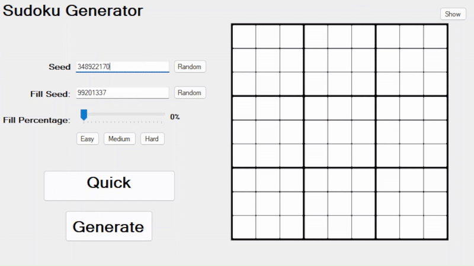
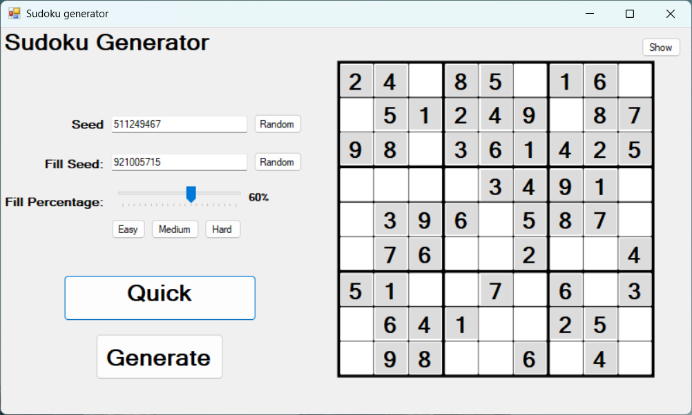
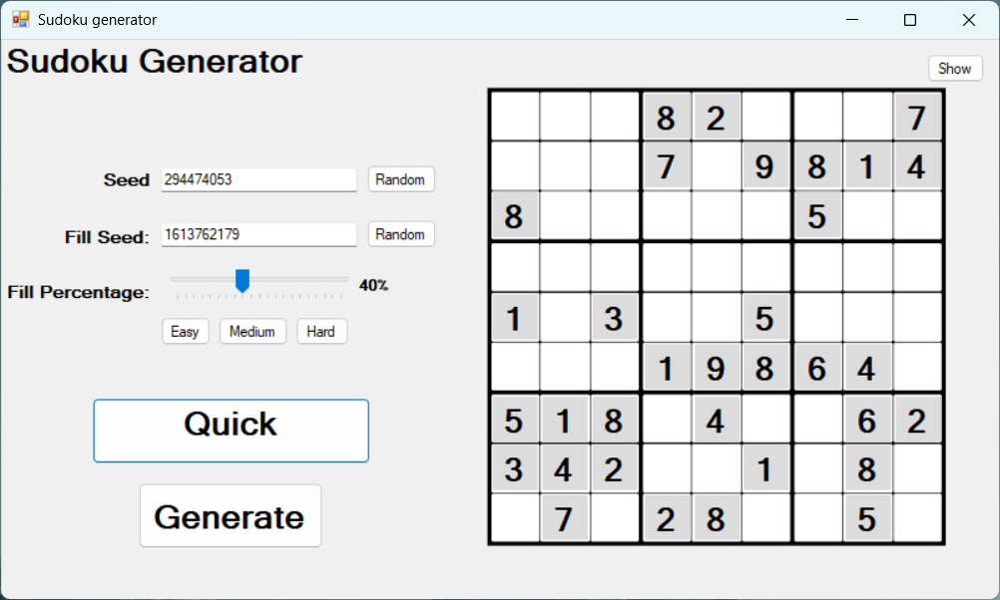
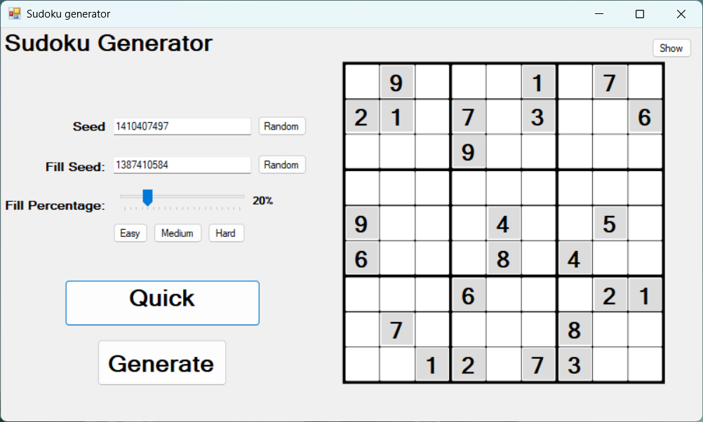

# Sudoku Generator

A C# desktop application that generates Sudoku puzzles of varying difficulty from two seeds, allowing users to interact with the application and explore how manipulating the seeds affects puzzle generation.

**Features**

Custom Puzzle Generation - Generate Sudoku puzzles of varying difficulty levels (Easy, Medium, Hard).

Seed-Based Generation - Two seeds are used, one for the fill pattern and one for number generation, allowing users to reproduce puzzles.

Optimised Generation - Puzzle generation is displayed in real time and heavily optimised for performance.

**Demo**

  <h4>Generating</h4>
   
  <h4>Difficulties: Easy | Medium | Hard</h4>
  
  
  

 
	
**How It Works**

The user selects the puzzle difficulty and clicks Generate.

The program generates a complete, valid Sudoku puzzle based on the number generation seed.

Cells are then removed according to the fill seed until the desired fill percentage (based on difficulty) is reached.

The user can choose to view the generation process or hide it for faster processing.

The visualization shows solving progress in real time, highlighting algorithm decisions and backtracking steps.

The finished puzzle cells are highlighted in grey, allowing the user to solve it manually or click Show Solution to view the completed puzzle.

**Usage**

Download the latest release: [SudokuGen.zip](https://github.com/Aaron-Antal-Bento/snake-game/releases).

Extract the files from the .zip and navigate into the `app.publish` folder.

Ether run `Sudoku generator.exe` directly or install the app using `setup.exe` and following the instuctions. 
